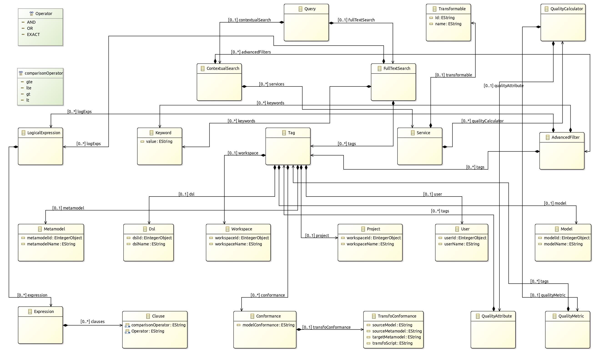

<<<<<<< HEAD
# MDEForge-Search System
MDEForge-Search, a novel tool introduced in this paper, addresses the need for efficient discovery and retrieval of modeling artifacts in the emerging field of model-driven engineering. Utilizing advanced discovery mechanisms, it retrieves heterogeneous artifacts within a megamodel context, promoting reuse across model management services. It features a domain-specific approach for queries using keywords, search tags, conditional operators, and a transformation chain discoverer, all in relation to quality model assessment services. Validated within a recommender system modeling framework, it leverages over 5,000 model artifacts currently stored in our cloud-based repository, MDEForge. Below is a guide on how to install and run the system from your host.

## Installation guide

Here is a guide on how you can do this:

1. Clone the git repository of the project.

```bash
git clone https://github.com/indamutsa/advanced-query.git
```

2. Get a working container. Everything will be installed via a disposable container to avoid installing various on your host. Run the command below in your host terminal in the folder cloned.

```bash
docker run -it --rm --net host -v /var/run/docker.sock:/var/run/docker.sock -v ${HOME}/.kube/:/root/.kube/ -v ${PWD}:/work -w /work -u root alpine sh 
```

3. Update the package repository and install necessary dependencies.

```bash
apk update
apk add --no-cache docker curl py-pip python3-dev libffi-dev openssl-dev gcc libc-dev make  zip bash openssl git
```

4. Install Docker Compose with pip (Python's package manager).

```bash
pip install docker-compose
```

Now, Docker Compose should be installed and you can confirm the installation by running:

```bash
docker-compose --version
```

It will return the version of Docker Compose installed, something like `docker-compose version 1.25.0, build 0a186604`.

---

To import data, we need to install MongoDB tools in an Alpine Linux container, you can use the official MongoDB packages. Here are the steps:

1. Start by adding the official MongoDB repository to your `/etc/apk/repositories` file:

```bash
echo "http://dl-cdn.alpinelinux.org/alpine/v3.14/community" >> /etc/apk/repositories
```

2. Update your package lists:

```bash
apk update
```

3. Then, install the MongoDB tools:

```bash
apk add mongodb-tools
```

Please make sure to replace `v3.14` with your specific Alpine version if it's different.

This will install the MongoDB shell (`mongo`), import (`mongoimport`), export (`mongoexport`), and other tools.

After installation, you can confirm that the tools are installed by running:

```bash
mongoimport --version
mongoexport --version
```

Each of these commands should return the version of the respective MongoDB tool.


Run the following command to start the system:

check if you can access the docker daemon from the container

```bash
docker images
```
It should return the list of images available on your system. At least alpine should be present.

Inside docker-compose.yml, change each of the following line to your local path
give it an absolute form the host (your machine) path where you have the data files

```
 source: /your absolute path to this folder/
```

### Using docker-compose
This might be the easier and faster way to run the system.

Run the following command to start the system:

```bash
docker-compose up
```

You can also run the system in detached mode by adding the `-d` flag:

```bash
docker-compose up -d
```

If you want to make sure changes to the docker-compose.yml file are applied, you can run the following command:

```bash
docker-compose up -d --build --force-recreate
```

#### Importing data
Let us import the data into the MongoDB cluster. This data will be synchronized into Elasticsearch by Monstache, a synchronization tool designed to continuously move data from MongoDB to Elasticsearch.

Here are the steps you should follow:
1. Connect to the MongoDB cluster and select the database where you want to insert your data.

   - The MongoDB cluster is accessible on port 27019 using this connection string: `mongodb://localhost:27019`
   - You can do this using the MongoDB shell or a GUI tool such as MongoDB Compass.
2. Download the data files from this <a href="https://drive.google.com/drive/folders/1hydGUBmqTuMW2FFqBNMdmTCOmn-vSF6X">link</a> and unzip them. You can run this command to unzip all the files at once.
   ```
   unzip \*.zip
   ```
3. Insert your data into the chosen database. You can do this either manually or by importing data from a file.
   You can speed up the process by using the script `import.sh` provided in the files folder. From the unzipped folder, mv import.sh script into the folder containing the unzipped and run the following commands:
   ```
   bash
   chmod +x import.sh
   ./import.sh relative_path_to_data_unzipped_folder
   sh
   ```
4. Let us rerurn monstache container to make sure the synchronization is working fine. Change the directory to the folder containing the docker-compose.yml file and run the following command:
   ```
   docker-compose up -d --force-recreate monstache
   ```
   This command will restart the Monstache container, which will trigger the synchronization process.

    
5. The frontend is accessible on port 3500. You can access it by navigating to `http://localhost:3500` in your browser. You can also access the Kibana dashboard on port 5601 to monitor the progress of the synchronization inside the dev tools section.

6. You can stop the system by running the following command:
   Be careful, the commands below will stop all the containers, images and volumes and remove them. 


   ```
   docker-compose down -v
   docker rm $(docker ps -aq)
   docker volume rm $(docker volume ls -q)
   docker rmi -f $(docker images -q) #remove all images
   ```
   
   You can stop one by one by running the following commands:
   ```
   docker-compose down -v
   docker stop container_name && docker rm container_name
   docker rmi -f image_name
   ```


### Using Kubernetes
This will require some knowledge of Kubernetes. 

Let us first install some utilities:

Install `kubectl`

```
curl -LO https://storage.googleapis.com/kubernetes-release/release/`curl -s https://storage.googleapis.com/kubernetes-release/release/stable.txt`/bin/linux/amd64/kubectl
chmod +x ./kubectl
mv ./kubectl /usr/local/bin/kubectl
```

Install `helm`

```
curl -fsSL -o get_helm.sh https://raw.githubusercontent.com/helm/helm/main/scripts/get-helm-3
chmod 700 get_helm.sh
./get_helm.sh
```

Install `kind`

```
# For AMD64 / x86_64
[ $(uname -m) = x86_64 ] && curl -Lo ./kind https://kind.sigs.k8s.io/dl/v0.19.0/kind-linux-amd64
# For ARM64
[ $(uname -m) = aarch64 ] && curl -Lo ./kind https://kind.sigs.k8s.io/dl/v0.19.0/kind-linux-arm64
chmod +x ./kind
mv ./kind /usr/local/bin/kind
```

Start a Kubernetes cluster using `kind`

```
kind create cluster --name mdeforge
```

Let us inspect the cluster

```
kubectl cluster-info --context kind-mdeforge
```

You should see something like this:

```
Kubernetes control plane is running at https://127.0.0.1:38513
CoreDNS is running at https://127.0.0.1:38513/api/v1/namespaces/kube-system/services/kube-dns:dns/proxy

To further debug and diagnose cluster problems, use 'kubectl cluster-info dump'.
```

Make sure the nodes are ready

```
```
kubectl get nodes
NAME                     STATUS   ROLES           AGE   VERSION
mdeforge-control-plane   Ready    control-plane   83s   v1.27.1
```

Change the folder to kubernetes folder and cd in the helm-charts.

Helm is a package manager for Kubernetes that simplifies deployment of applications to your Kubernetes clusters. Below are some of the most frequently used Helm commands:

1. **Search a Chart**
    ```bash
    helm search hub <chart>  # Searches for a chart on Helm Hub
    ```

2. **Add a Chart Repository**
    ```bash
    helm repo add <repo_name> <repo_url>  # Adds a chart repository
    helm repo update  # Updates chart repository
    ```

3. **Install a Chart**
    ```bash
    helm install <release_name> <chart>  # Installs a chart
    ```

4. **Update a Chart**
    ```bash
    helm upgrade <release_name> <chart>  # Updates the deployed chart
    ```

5. **Rollback a Chart**
    ```bash
    helm rollback <release_name> <revision_number>  # Rollbacks to an older version of a release
    ```

6. **List all Deployed Charts**
    ```bash
    helm list  # Lists all the deployed charts
    ```

7. **Show Chart Information**
    ```bash
    helm show chart <chart>  # Shows information of a chart
    ```

8. **Uninstall a Release**
    ```bash
    helm uninstall <release_name>  # Uninstalls a release
    ```

9. **Create a Chart**
    ```bash
    helm create <chart_name>  # Creates a new chart with the given name
    ```

10. **Lint a Chart**
    ```bash
    helm lint <chart_path>  # Examines a chart for possible issues
    ```

11. **Package a Chart**
    ```bash
    helm package <chart_path>  # Packages a chart into a versioned chart archive
    ```

These are some basic commands. Depending on your use-case, you might need to use other commands as well. For the complete list of commands, you can run `helm --help` or check the Helm documentation. 

Remember to replace `<release_name>`, `<chart>`, `<repo_name>`, `<repo_url>`, `<revision_number>`, and `<chart_path>` with your actual values.

Let us spin up the cluster by running the following commands:

```
helm install .
```

You can check the status of the pods by running the following command:

```
kubectl get pods
```

You can check the status of the services by running the following command:

```
kubectl get services
```

You can check the status of the deployments by running the following command:

```
kubectl get deployments
```

You can check the status of the persistent volumes by running the following command:

```
kubectl get pv
```

You can check the status of the persistent volume claims by running the following command:

```
kubectl get pvc
```

You can check the status of the above resources by running the following command:

```
kubectl get all
```

To feed the data in the cluster, port forward the cluster primary node to your local machine. You might also need to port forward the Elasticsearch service to your local machine and then follow the steps inside docker-compose section from _importing data_ subsection .

port forwading uses this command:

```
kubectl port-forward <pod_name> <local_port>:<pod_port>
```
=======
# Elastic stack (ELK) on Docker

[](https://www.elastic.co/blog/category/releases)
[](https://github.com/deviantony/docker-elk/actions?query=workflow%3ACI+branch%3Amain)
[](https://gitter.im/deviantony/docker-elk?utm_source=badge&utm_medium=badge&utm_campaign=pr-badge&utm_content=badge)

Run the latest version of the [Elastic stack][elk-stack] with Docker and Docker Compose.

It gives you the ability to analyze any data set by using the searching/aggregation capabilities of Elasticsearch and
the visualization power of Kibana.

_:information_source: The Docker images backing this stack include [X-Pack][xpack] with [paid features][paid-features]
enabled by default (see [How to disable paid features](#how-to-disable-paid-features) to disable them). **The [trial
license][trial-license] is valid for 30 days**. After this license expires, you can continue using the free features
seamlessly, without losing any data._

Based on the official Docker images from Elastic:

- [Elasticsearch](https://github.com/elastic/elasticsearch/tree/master/distribution/docker)
- [Logstash](https://github.com/elastic/logstash/tree/master/docker)
- [Kibana](https://github.com/elastic/kibana/tree/master/src/dev/build/tasks/os_packages/docker_generator)

Other available stack variants:

- [`tls`](https://github.com/deviantony/docker-elk/tree/tls): TLS encryption enabled in Elasticsearch.
- [`searchguard`](https://github.com/deviantony/docker-elk/tree/searchguard): Search Guard support

---

## Philosophy

We aim at providing the simplest possible entry into the Elastic stack for anybody who feels like experimenting with
this powerful combo of technologies. This project's default configuration is purposely minimal and unopinionated. It
does not rely on any external dependency or custom automation to get things up and running.

Instead, we believe in good documentation so that you can use this repository as a template, tweak it, and make it _your
own_. [sherifabdlnaby/elastdocker][elastdocker] is one example among others of project that builds upon this idea.

---

## Contents

1. [Requirements](#requirements)
   - [Host setup](#host-setup)
   - [SELinux](#selinux)
   - [Docker Desktop](#docker-desktop)
     - [Windows](#windows)
     - [macOS](#macos)
1. [Usage](#usage)
   - [Version selection](#version-selection)
   - [Bringing up the stack](#bringing-up-the-stack)
   - [Cleanup](#cleanup)
   - [Initial setup](#initial-setup)
     - [Setting up user authentication](#setting-up-user-authentication)
     - [Injecting data](#injecting-data)
     - [Default Kibana index pattern creation](#default-kibana-index-pattern-creation)
1. [Configuration](#configuration)
   - [How to configure Elasticsearch](#how-to-configure-elasticsearch)
   - [How to configure Kibana](#how-to-configure-kibana)
   - [How to configure Logstash](#how-to-configure-logstash)
   - [How to disable paid features](#how-to-disable-paid-features)
   - [How to scale out the Elasticsearch cluster](#how-to-scale-out-the-elasticsearch-cluster)
   - [How to reset a password programmatically](#how-to-reset-a-password-programmatically)
1. [Extensibility](#extensibility)
   - [How to add plugins](#how-to-add-plugins)
   - [How to enable the provided extensions](#how-to-enable-the-provided-extensions)
1. [JVM tuning](#jvm-tuning)
   - [How to specify the amount of memory used by a service](#how-to-specify-the-amount-of-memory-used-by-a-service)
   - [How to enable a remote JMX connection to a service](#how-to-enable-a-remote-jmx-connection-to-a-service)
1. [Going further](#going-further)
   - [Plugins and integrations](#plugins-and-integrations)
   - [Swarm mode](#swarm-mode)

## Requirements

### Host setup

- [Docker Engine](https://docs.docker.com/install/) version **17.05** or newer
- [Docker Compose](https://docs.docker.com/compose/install/) version **1.20.0** or newer
- 1.5 GB of RAM

_:information_source: Especially on Linux, make sure your user has the [required permissions][linux-postinstall] to
interact with the Docker daemon._

By default, the stack exposes the following ports:

- 5044: Logstash Beats input
- 5000: Logstash TCP input
- 9600: Logstash monitoring API
- 9200: Elasticsearch HTTP
- 9300: Elasticsearch TCP transport
- 5601: Kibana

**:warning: Elasticsearch's [bootstrap checks][booststap-checks] were purposely disabled to facilitate the setup of the
Elastic stack in development environments. For production setups, we recommend users to set up their host according to
the instructions from the Elasticsearch documentation: [Important System Configuration][es-sys-config].**

### SELinux

On distributions which have SELinux enabled out-of-the-box you will need to either re-context the files or set SELinux
into Permissive mode in order for docker-elk to start properly. For example on Redhat and CentOS, the following will
apply the proper context:

```console
$ chcon -R system_u:object_r:admin_home_t:s0 docker-elk/
```

### Docker Desktop

#### Windows

If you are using the legacy Hyper-V mode of _Docker Desktop for Windows_, ensure [File Sharing][win-filesharing] is
enabled for the `C:` drive.

#### macOS

The default configuration of _Docker Desktop for Mac_ allows mounting files from `/Users/`, `/Volume/`, `/private/`,
`/tmp` and `/var/folders` exclusively. Make sure the repository is cloned in one of those locations or follow the
instructions from the [documentation][mac-filesharing] to add more locations.

## Usage

### Version selection

This repository tries to stay aligned with the latest version of the Elastic stack. The `main` branch tracks the current
major version (7.x).

To use a different version of the core Elastic components, simply change the version number inside the `.env` file. If
you are upgrading an existing stack, please carefully read the note in the next section.

**:warning: Always pay attention to the [official upgrade instructions][upgrade] for each individual component before
performing a stack upgrade.**

Older major versions are also supported on separate branches:

- [`release-6.x`](https://github.com/deviantony/docker-elk/tree/release-6.x): 6.x series
- [`release-5.x`](https://github.com/deviantony/docker-elk/tree/release-5.x): 5.x series (End-Of-Life)

### Bringing up the stack

Clone this repository onto the Docker host that will run the stack, then start services locally using Docker Compose:

```console
$ docker-compose up
```

You can also run all services in the background (detached mode) by adding the `-d` flag to the above command.

**:warning: You must rebuild the stack images with `docker-compose build` whenever you switch branch or update the
version of an already existing stack.**

If you are starting the stack for the very first time, please read the section below attentively.

### Cleanup

Elasticsearch data is persisted inside a volume by default.

In order to entirely shutdown the stack and remove all persisted data, use the following Docker Compose command:

```console
$ docker-compose down -v
```

## Initial setup

### Setting up user authentication

_:information_source: Refer to [How to disable paid features](#how-to-disable-paid-features) to disable authentication._

The stack is pre-configured with the following **privileged** bootstrap user:

- user: _elastic_
- password: _changeme_

Although all stack components work out-of-the-box with this user, we strongly recommend using the unprivileged [built-in
users][builtin-users] instead for increased security.

1. Initialize passwords for built-in users

   ```console
   $ docker-compose exec -T elasticsearch bin/elasticsearch-setup-passwords auto --batch
   ```

   Passwords for all 6 built-in users will be randomly generated. Take note of them.

1. Unset the bootstrap password (_optional_)

   Remove the `ELASTIC_PASSWORD` environment variable from the `elasticsearch` service inside the Compose file
   (`docker-compose.yml`). It is only used to initialize the keystore during the initial startup of Elasticsearch.

1. Replace usernames and passwords in configuration files

   Use the `kibana_system` user (`kibana` for releases <7.8.0) inside the Kibana configuration file
   (`kibana/config/kibana.yml`) and the `logstash_system` user inside the Logstash configuration file
   (`logstash/config/logstash.yml`) in place of the existing `elastic` user.

   Replace the password for the `elastic` user inside the Logstash pipeline file (`logstash/pipeline/logstash.conf`).

   _:information_source: Do not use the `logstash_system` user inside the Logstash **pipeline** file, it does not have
   sufficient permissions to create indices. Follow the instructions at [Configuring Security in Logstash][ls-security]
   to create a user with suitable roles._

   See also the [Configuration](#configuration) section below.

1. Restart Kibana and Logstash to apply changes

   ```console
   $ docker-compose restart kibana logstash
   ```

   _:information_source: Learn more about the security of the Elastic stack at [Secure the Elastic
   Stack][sec-cluster]._

### Injecting data

Give Kibana about a minute to initialize, then access the Kibana web UI by opening <http://localhost:5601> in a web
browser and use the following credentials to log in:

- user: _elastic_
- password: _\<your generated elastic password>_

Now that the stack is running, you can go ahead and inject some log entries. The shipped Logstash configuration allows
you to send content via TCP:

```console
# Using BSD netcat (Debian, Ubuntu, MacOS system, ...)
$ cat /path/to/logfile.log | nc -q0 localhost 5000
```

```console
# Using GNU netcat (CentOS, Fedora, MacOS Homebrew, ...)
$ cat /path/to/logfile.log | nc -c localhost 5000
```

You can also load the sample data provided by your Kibana installation.

### Default Kibana index pattern creation

When Kibana launches for the first time, it is not configured with any index pattern.

#### Via the Kibana web UI

_:information_source: You need to inject data into Logstash before being able to configure a Logstash index pattern via
the Kibana web UI._

Navigate to the _Discover_ view of Kibana from the left sidebar. You will be prompted to create an index pattern. Enter
`logstash-*` to match Logstash indices then, on the next page, select `@timestamp` as the time filter field. Finally,
click _Create index pattern_ and return to the _Discover_ view to inspect your log entries.

Refer to [Connect Kibana with Elasticsearch][connect-kibana] and [Creating an index pattern][index-pattern] for detailed
instructions about the index pattern configuration.

#### On the command line

Create an index pattern via the Kibana API:

```console
$ curl -XPOST -D- 'http://localhost:5601/api/saved_objects/index-pattern' \
    -H 'Content-Type: application/json' \
    -H 'kbn-version: 7.15.1' \
    -u elastic:<your generated elastic password> \
    -d '{"attributes":{"title":"logstash-*","timeFieldName":"@timestamp"}}'
```

The created pattern will automatically be marked as the default index pattern as soon as the Kibana UI is opened for the
first time.

## Configuration

_:information_source: Configuration is not dynamically reloaded, you will need to restart individual components after
any configuration change._

### How to configure Elasticsearch

The Elasticsearch configuration is stored in [`elasticsearch/config/elasticsearch.yml`][config-es].

You can also specify the options you want to override by setting environment variables inside the Compose file:

```yml
elasticsearch:
  environment:
    network.host: _non_loopback_
    cluster.name: my-cluster
```

Please refer to the following documentation page for more details about how to configure Elasticsearch inside Docker
containers: [Install Elasticsearch with Docker][es-docker].

### How to configure Kibana

The Kibana default configuration is stored in [`kibana/config/kibana.yml`][config-kbn].

It is also possible to map the entire `config` directory instead of a single file.

Please refer to the following documentation page for more details about how to configure Kibana inside Docker
containers: [Install Kibana with Docker][kbn-docker].

### How to configure Logstash

The Logstash configuration is stored in [`logstash/config/logstash.yml`][config-ls].

It is also possible to map the entire `config` directory instead of a single file, however you must be aware that
Logstash will be expecting a [`log4j2.properties`][log4j-props] file for its own logging.

Please refer to the following documentation page for more details about how to configure Logstash inside Docker
containers: [Configuring Logstash for Docker][ls-docker].

### How to disable paid features

Switch the value of Elasticsearch's `xpack.license.self_generated.type` option from `trial` to `basic` (see [License
settings][trial-license]).

### How to scale out the Elasticsearch cluster

Follow the instructions from the Wiki: [Scaling out Elasticsearch](https://github.com/deviantony/docker-elk/wiki/Elasticsearch-cluster)

### How to reset a password programmatically

If for any reason your are unable to use Kibana to change the password of your users (including [built-in
users][builtin-users]), you can use the Elasticsearch API instead and achieve the same result.

In the example below, we reset the password of the `elastic` user (notice "/user/elastic" in the URL):

```console
$ curl -XPOST -D- 'http://localhost:9200/_security/user/elastic/_password' \
    -H 'Content-Type: application/json' \
    -u elastic:<your current elastic password> \
    -d '{"password" : "<your new password>"}'
```

## Extensibility

### How to add plugins

To add plugins to any ELK component you have to:

1. Add a `RUN` statement to the corresponding `Dockerfile` (eg. `RUN logstash-plugin install logstash-filter-json`)
1. Add the associated plugin code configuration to the service configuration (eg. Logstash input/output)
1. Rebuild the images using the `docker-compose build` command

### How to enable the provided extensions

A few extensions are available inside the [`extensions`](extensions) directory. These extensions provide features which
are not part of the standard Elastic stack, but can be used to enrich it with extra integrations.

The documentation for these extensions is provided inside each individual subdirectory, on a per-extension basis. Some
of them require manual changes to the default ELK configuration.

## JVM tuning

### How to specify the amount of memory used by a service

By default, both Elasticsearch and Logstash start with [1/4 of the total host
memory](https://docs.oracle.com/javase/8/docs/technotes/guides/vm/gctuning/parallel.html#default_heap_size) allocated to
the JVM Heap Size.

The startup scripts for Elasticsearch and Logstash can append extra JVM options from the value of an environment
variable, allowing the user to adjust the amount of memory that can be used by each component:

| Service       | Environment variable |
| ------------- | -------------------- |
| Elasticsearch | ES_JAVA_OPTS         |
| Logstash      | LS_JAVA_OPTS         |

To accomodate environments where memory is scarce (Docker for Mac has only 2 GB available by default), the Heap Size
allocation is capped by default to 256MB per service in the `docker-compose.yml` file. If you want to override the
default JVM configuration, edit the matching environment variable(s) in the `docker-compose.yml` file.

For example, to increase the maximum JVM Heap Size for Logstash:

```yml
logstash:
  environment:
    LS_JAVA_OPTS: -Xmx1g -Xms1g
```

### How to enable a remote JMX connection to a service

As for the Java Heap memory (see above), you can specify JVM options to enable JMX and map the JMX port on the Docker
host.

Update the `{ES,LS}_JAVA_OPTS` environment variable with the following content (I've mapped the JMX service on the port
18080, you can change that). Do not forget to update the `-Djava.rmi.server.hostname` option with the IP address of your
Docker host (replace **DOCKER_HOST_IP**):

```yml
logstash:
  environment:
    LS_JAVA_OPTS: -Dcom.sun.management.jmxremote -Dcom.sun.management.jmxremote.ssl=false -Dcom.sun.management.jmxremote.authenticate=false -Dcom.sun.management.jmxremote.port=18080 -Dcom.sun.management.jmxremote.rmi.port=18080 -Djava.rmi.server.hostname=DOCKER_HOST_IP -Dcom.sun.management.jmxremote.local.only=false
```

## Going further

### Plugins and integrations

See the following Wiki pages:

- [External applications](https://github.com/deviantony/docker-elk/wiki/External-applications)
- [Popular integrations](https://github.com/deviantony/docker-elk/wiki/Popular-integrations)

### Swarm mode

Experimental support for Docker [Swarm mode][swarm-mode] is provided in the form of a `docker-stack.yml` file, which can
be deployed in an existing Swarm cluster using the following command:

```console
$ docker stack deploy -c docker-stack.yml elk
```

If all components get deployed without any error, the following command will show 3 running services:

```console
$ docker stack services elk
```

_:information_source: To scale Elasticsearch in Swarm mode, configure seed hosts with the DNS name `tasks.elasticsearch`
instead of `elasticsearch`._

[elk-stack]: https://www.elastic.co/what-is/elk-stack
[xpack]: https://www.elastic.co/what-is/open-x-pack
[paid-features]: https://www.elastic.co/subscriptions
[trial-license]: https://www.elastic.co/guide/en/elasticsearch/reference/current/license-settings.html
[elastdocker]: https://github.com/sherifabdlnaby/elastdocker
[linux-postinstall]: https://docs.docker.com/install/linux/linux-postinstall/
[booststap-checks]: https://www.elastic.co/guide/en/elasticsearch/reference/current/bootstrap-checks.html
[es-sys-config]: https://www.elastic.co/guide/en/elasticsearch/reference/current/system-config.html
[win-filesharing]: https://docs.docker.com/desktop/windows/#file-sharing
[mac-filesharing]: https://docs.docker.com/desktop/mac/#file-sharing
[builtin-users]: https://www.elastic.co/guide/en/elasticsearch/reference/current/built-in-users.html
[ls-security]: https://www.elastic.co/guide/en/logstash/current/ls-security.html
[sec-cluster]: https://www.elastic.co/guide/en/elasticsearch/reference/current/secure-cluster.html
[connect-kibana]: https://www.elastic.co/guide/en/kibana/current/connect-to-elasticsearch.html
[index-pattern]: https://www.elastic.co/guide/en/kibana/current/index-patterns.html
[config-es]: ./elasticsearch/config/elasticsearch.yml
[config-kbn]: ./kibana/config/kibana.yml
[config-ls]: ./logstash/config/logstash.yml
[es-docker]: https://www.elastic.co/guide/en/elasticsearch/reference/current/docker.html
[kbn-docker]: https://www.elastic.co/guide/en/kibana/current/docker.html
[ls-docker]: https://www.elastic.co/guide/en/logstash/current/docker-config.html
[log4j-props]: https://github.com/elastic/logstash/tree/7.6/docker/data/logstash/config
[esuser]: https://github.com/elastic/elasticsearch/blob/7.6/distribution/docker/src/docker/Dockerfile#L23-L24
[upgrade]: https://www.elastic.co/guide/en/elasticsearch/reference/current/setup-upgrade.html
[swarm-mode]: https://docs.docker.com/engine/swarm/

## Query engine




elastic: http://178.238.238.209:5601/app/home#/ https://178.238.238.209.sslip.io     

etl transformation: http://178.238.238.209:8085/mms/api-docs/transform
etl query: http://178.238.238.209:8087/mms/api-docs/query
etl metrics: http://178.238.238.209:8186/mms/api-docs/metrics
etl validate: http://178.238.238.209:8086/mms/api-docs/validate
api http://178.238.238.209:3200/store/api-docs/ https://178.238.238.209.sslip.io/repo/store/api-docs/


mongodb://178.238.238.209:27019/mdeforge
>>>>>>> eac889988eaa001bbb110548cab4098c97cf68e4
